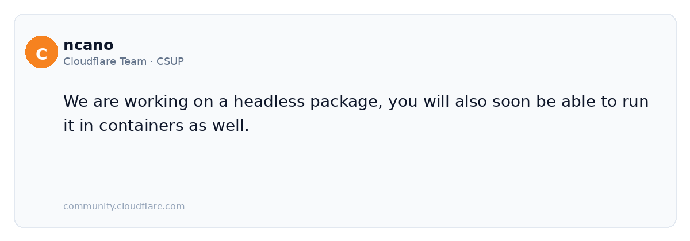
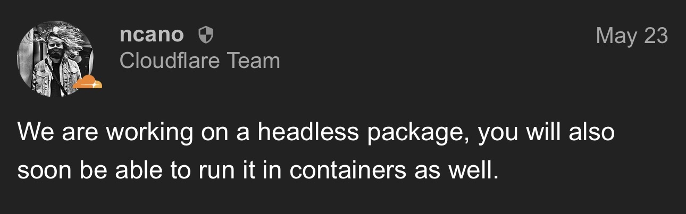

# warp-cli-smol

Headless Cloudflare WARP for Debian / guest VMs — `warp-cli` + `warp-svc`, no AppIndicator, no WebKit, no desktop.

```bash
curl -fsSL https://raw.githubusercontent.com/thenicholasnick-grok/warp-cli-smol/main/install.sh | sudo bash
```

Zero Trust MDM: drop `/var/lib/cloudflare-warp/mdm.xml` (`organization`, `auth_client_id`, `auth_client_secret`) and the running daemon connects.

Install assets are served from `raw.githubusercontent.com` (dual-stack). GitHub Release downloads go through `github.com`, which has no AAAA — IPv6-only guests get `Network is unreachable`.



**Updates are automatic:** each CI run live-fetches Cloudflare's current Debian trixie `Packages` index (no version pin in this repo) on `workflow_dispatch` and every Monday 06:00 UTC, then publishes a rolling `latest` GitHub Release **and** force-pushes the same stable-name `.deb` + `SHA256SUMS` to the orphan `install-dist` branch (single commit, replaced each run). Repo edits are only needed if Cloudflare changes package shape, Depends, paths, or suite.

Unofficial. Debian trixie amd64 only — not an official Cloudflare package.

Official Debian `cloudflare-warp` hard-depends on AppIndicator + WebKit, which drags a desktop onto a server. See [Debian WARP package requires full desktop environment on a server](https://community.cloudflare.com/t/debian-warp-package-requires-full-desktop-environment-on-a-server/928991).

Cloudflare Team (ncano), 2026-05-23:



<details>
<summary>Install details: direct <code>.deb</code> URL, and do not <code>apt-get install cloudflare-warp</code>.</summary>

No GitHub login. The one-liner downloads the stable asset from `install-dist`, checks it against `SHA256SUMS` from the same branch, then `dpkg -i`s it. Install refuses if the checksum file is missing, empty, or does not match. The guest needs outbound HTTPS to `raw.githubusercontent.com` (not `github.com`). After a successful `dpkg -i`, `install.sh` checks whether systemd/`warp-svc` looks healthy and prints next steps if not. MDM is optional; install still exits 0 without it.

```text
https://raw.githubusercontent.com/thenicholasnick-grok/warp-cli-smol/install-dist/cloudflare-warp-headless_amd64.deb
https://raw.githubusercontent.com/thenicholasnick-grok/warp-cli-smol/install-dist/SHA256SUMS
```

Browsers on IPv4 can also use the rolling GitHub Release (`releases/latest`).

Prove on an IPv6-only guest:

```bash
curl -6 -fsSI https://raw.githubusercontent.com/thenicholasnick-grok/warp-cli-smol/install-dist/cloudflare-warp-headless_amd64.deb
curl -6 -fsSI https://raw.githubusercontent.com/thenicholasnick-grok/warp-cli-smol/install-dist/SHA256SUMS
# expected: HTTP 200

curl -6 -fsSI https://github.com/
# expected: fail (no AAAA / Network is unreachable)
```

Direct one-liner without the script (still verify before `dpkg -i`):

```bash
cd /tmp && \
curl -fsSL -O https://raw.githubusercontent.com/thenicholasnick-grok/warp-cli-smol/install-dist/cloudflare-warp-headless_amd64.deb && \
curl -fsSL -O https://raw.githubusercontent.com/thenicholasnick-grok/warp-cli-smol/install-dist/SHA256SUMS && \
sha256sum -c --ignore-missing --strict SHA256SUMS && \
sudo dpkg -i cloudflare-warp-headless_amd64.deb
```

**Do not** install the official package afterwards:

```bash
# Do NOT run this. It pulls the full GUI client and fights this package.
sudo apt-get install cloudflare-warp
```

Do not add Cloudflare's APT repo and `apt-get install cloudflare-warp` on the same machine. That replaces or conflicts with the headless binaries (`/bin/warp-cli`, `/bin/warp-svc`).

The rebuilt package keeps `warp-cli`, `warp-svc`, and `warp-svc.service`. It drops desktop-file, AppIndicator, and WebKit dependencies, plus the taskbar/Flutter tree.

`.deb` files are never committed to `main`. The rolling stable `.deb` lives only on `install-dist` (force-replaced each successful CI run). Cloudflare also publishes bookworm, jammy, noble, and other suites; those are different `.deb`s and are not used.

</details>

<details>
<summary>Zero Trust MDM: <code>/var/lib/cloudflare-warp/mdm.xml</code> shape.</summary>

Place this file after install (placeholders only — use your team values). `warp-svc` must be running; the daemon connects on its own. Install does not require the file and never logs credentials.

```xml
<dict>
  <key>organization</key>
  <string>team-name-here</string>
  <key>auth_client_id</key>
  <string>xxxx.access</string>
  <key>auth_client_secret</key>
  <string>cfast_xxxx</string>
</dict>
```

</details>

<details>
<summary>What CI does: proofs, artifacts, and the rolling release assets.</summary>

- `ubuntu-latest`, on `workflow_dispatch` and weekly Monday 06:00 UTC.
- Installs `dpkg-dev` and `binutils`.
- Runs `./repack.sh` against the live Debian trixie index from [Cloudflare's public APT repo](https://pkg.cloudflareclient.com) (`dists/trixie/main/binary-amd64/Packages`). The job fails if Filename is not under `pool/trixie/` or if any proof fails:
  1. New control has no `webkit` and no `appindicator`.
  2. `readelf -d` on `bin/warp-cli` `NEEDED` is only `libc`, `libm`, `libgcc_s`.
  3. `readelf -d` on `bin/warp-svc` does not show webkit or gtk.
- Uploads the versioned `.deb` with `actions/upload-artifact` (`retention-days: 14`).
- Recreates the rolling GitHub Release tagged `latest` and uploads:
  - `cloudflare-warp-headless_amd64.deb` (stable name)
  - `cloudflare-warp-headless_<upstream-version>_amd64.deb` (same bits, versioned name)
  - `SHA256SUMS` (sha256 of both `.deb` names; `install.sh` requires the stable-name line before `dpkg -i`)
- Force-pushes an orphan `install-dist` branch with only the stable `.deb` and the same `SHA256SUMS` so IPv6-only guests can fetch via `raw.githubusercontent.com` without hitting `github.com:443`.

Proofs must pass before either publish step runs.

</details>

<details>
<summary>Local rebuild: install <code>dpkg-dev</code> and <code>binutils</code>, then run <code>./repack.sh</code>.</summary>

```bash
sudo apt-get install -y dpkg-dev binutils
./repack.sh
```

Work files land in `downloads/` and `work/` (gitignored). The output `.deb` is written to the repo root and is also gitignored.

</details>
